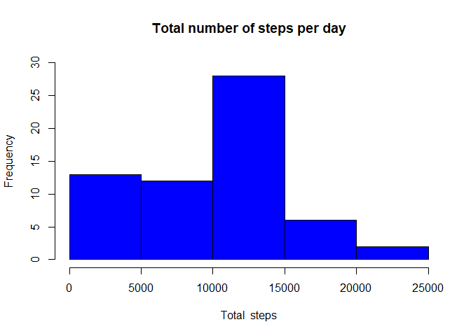
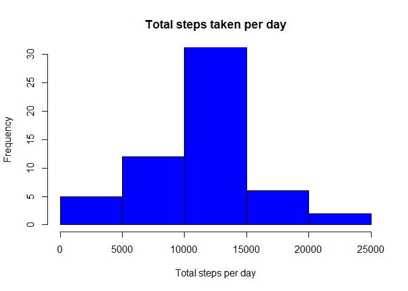

#1 download the data

```r
file <- "course5hw1.zip"
site <- "https://d396qusza40orc.cloudfront.net/repdata%2Fdata%2Factivity.zip"
download.file(site, file,method="curl")
unzip(file) 
```

#1 read the dataset

```r
activity <- read.csv("activity.csv", stringsAsFactors=FALSE)
```


```r
head(activity)
```

```
##   steps       date interval
## 1    NA 2012-10-01        0
## 2    NA 2012-10-01        5
## 3    NA 2012-10-01       10
## 4    NA 2012-10-01       15
## 5    NA 2012-10-01       20
## 6    NA 2012-10-01       25
```

#2 Histogram

```r
hist_data <- aggregate(activity$steps, by=list(activity$date), sum, na.rm=TRUE)
names(hist_data) <- c("date", "total")
hist(hist_data$total, 
     breaks=seq(from=0, to=25000, by=5000),
     col="blue", 
     xlab="Total  steps", 
     ylim=c(0, 30), 
     main="Total number of steps per day")
```

<!-- -->

#3 Mean and median total steps per day


```r
mean(hist_data$total)
```

```
## [1] 9354.23
```

```r
median(hist_data$total)
```

```
## [1] 10395
```

#4 Compute the means of steps accross all days for each interval

```r
library(ggplot2)
mean_data <- aggregate(activity$steps, 
                       by=list(activity$interval), 
                       FUN=mean, 
                       na.rm=TRUE)

names(mean_data) <- c("interval", "mean")
 ggplot(data=mean_data, aes(interval,mean)) + 
   geom_line() + xlab("5-minute interval") + ylab("average number of steps taken")
```

<!-- -->


#5 The 5-minute interval that, on average, contains the maximum number of steps

```r
max_interval <- which.max(mean_data$mean)
mean_data[max_interval, ]
```

```
##     interval     mean
## 104      835 206.1698
```


#6 Code to describe and show a strategy for imputing missing data

```r
clean<- mean_data$mean[match(activity$interval,mean_data$interval)]
#new dataset qual to the original dataset with the missing data 

cleaned_activity <- transform(activity, steps = ifelse(is.na(activity$steps), yes = clean, no = activity$steps))

total<- aggregate(steps ~ date, cleaned_activity, sum)

names(total)<- c("date", "daily_steps")

hist(total$daily_steps, col = "blue", xlab = "Total steps per day",
     ylim=c(0, 30), 
     main = "Total steps taken per day",)
```

<!-- -->

```r
#new mean and median with additional data
mean(total$daily_steps)
```

```
## [1] 10766.19
```

```r
median(total$daily_steps)
```

```
## [1] 10766.19
```
